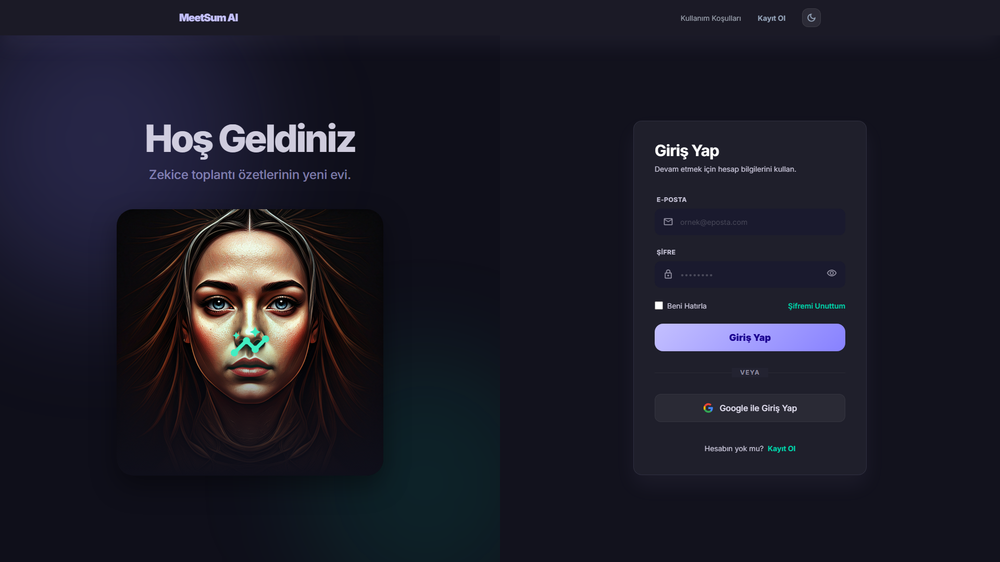
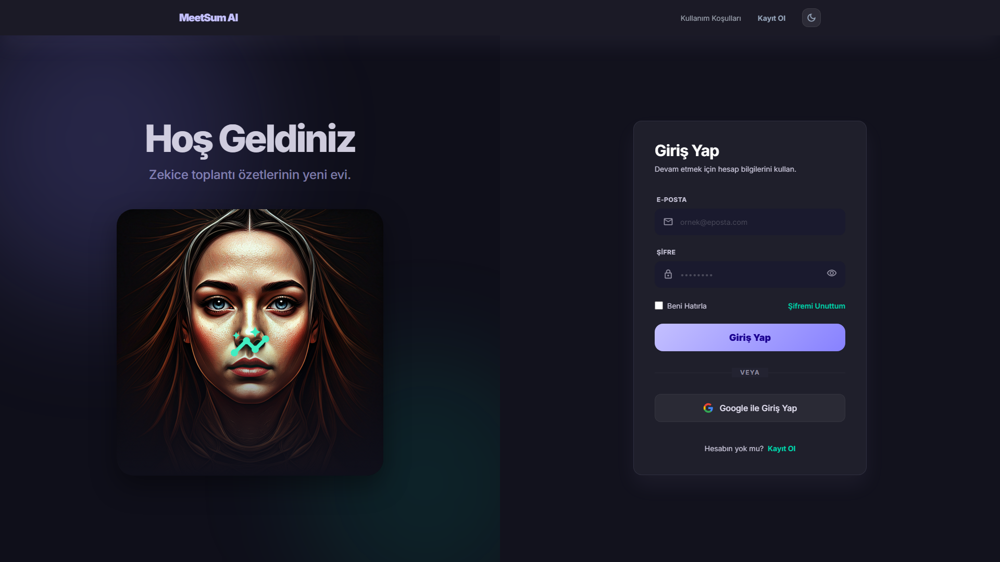
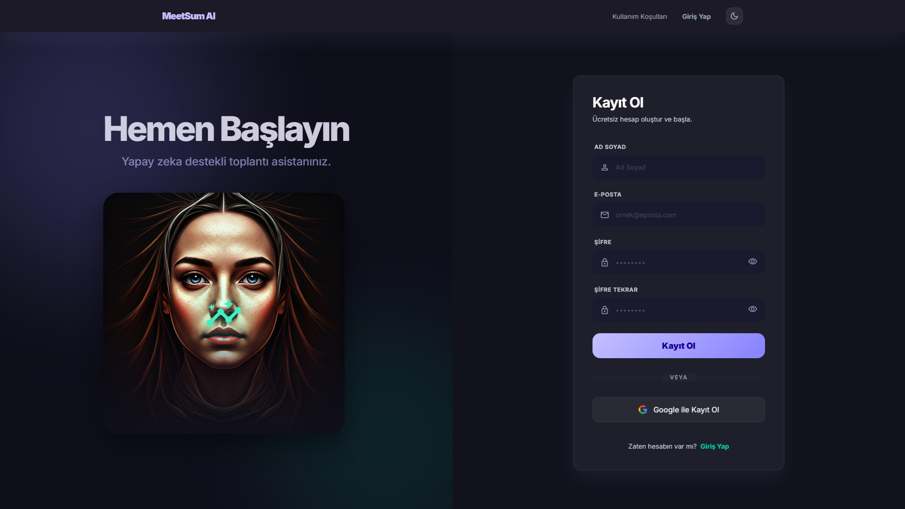
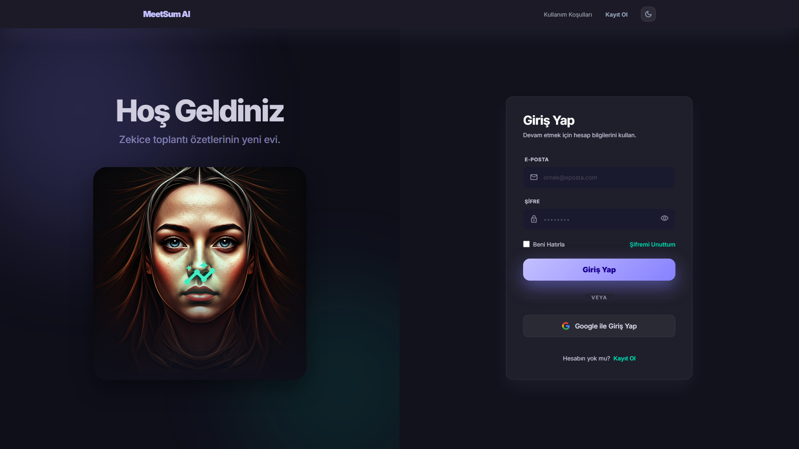
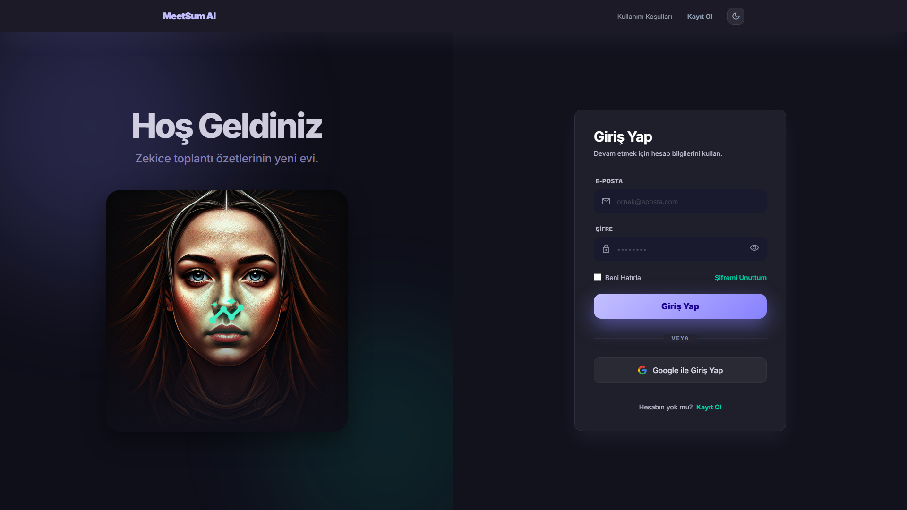
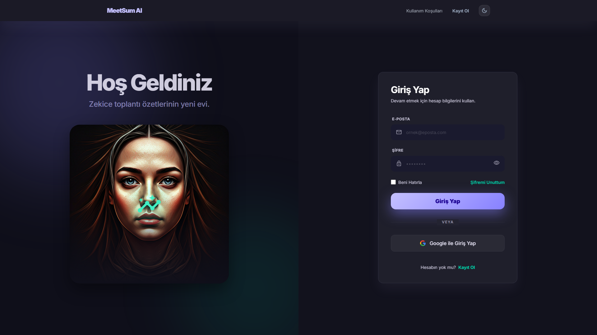
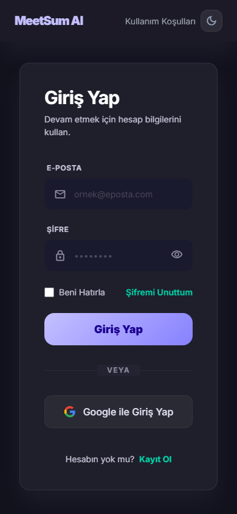
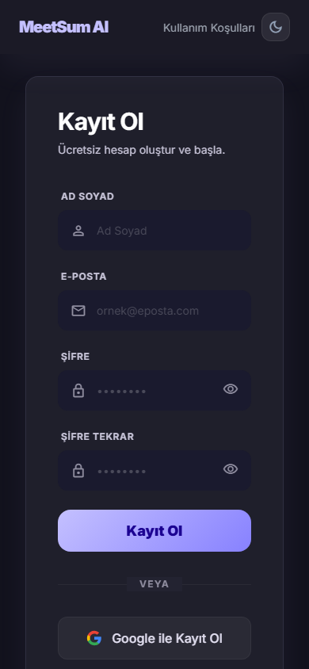

# MeetSum AI - Yapay Zeka Destekli Toplanti Ozetleme Platformu

---

## Ogrenci Bilgileri

| Bilgi | Detay |
|-------|-------|
| **Ad Soyad** | Eyup Ensar Acar |
| **Ogrenci No** | 24010501093 |
| **Ders** | PP214 / BTE208 - Yapay Zeka Destekli Urun Tasarimi ve Gelistirme |
| **Donem** | 2025-2026 Bahar |

---

## GitHub Proje Baglantisi

**https://github.com/eyupx/meetsum-ai**

---

## Projenin Amaci ve Aciklamasi

**MeetSum AI**, toplanti metinlerini ve ses kayitlarini yapay zeka ile analiz ederek otomatik ozet, eylem maddeleri, karar takibi ve anahtar konu cikarimi yapan bir web uygulamasidir.

Toplantilar sonrasinda alinan kararlar ve gorev dagilimlari genellikle kaybolur. MeetSum AI bu sorunu cozmek icin gelistirilmistir. Kullanici toplanti metnini yapistirabilir, dosya yukleyebilir (TXT, DOCX, PDF) veya ses dosyasi yukleyebilir (MP3, WAV, M4A). Sistem metni AI ile analiz edip yapılandirilmis bir ozet olusturur.

### Temel Ozellikler
- Metin, dosya ve ses dosyasi ile toplanti ozeti olusturma
- Yapay zeka ile otomatik ozetleme (Groq Llama 3.3 70B)
- Ses dosyasindan otomatik transkript (Groq Whisper API)
- Firebase Authentication (Google + E-posta)
- Firebase Firestore ile bulut veritabani
- Turkce ve Ingilizce dil destegi
- Dark/Light tema
- PDF indirme, kopyalama, paylasma
- Responsive tasarim (mobil, tablet, masaustu)

---

## Kullanilan Teknolojiler ve Kutuphaneler

| Kategori | Teknoloji | Aciklama |
|----------|-----------|----------|
| **Frontend** | HTML5, CSS3, Vanilla JavaScript (ES6+) | SPA (Single Page Application) mimarisi |
| **AI Ozetleme** | Groq API - Llama 3.3 70B Versatile | Toplanti metni analizi, JSON cikti |
| **Ses Tanima** | Groq Whisper API - whisper-large-v3-turbo | MP3/WAV/M4A dosyalarindan Turkce transkript |
| **Kimlik Dogrulama** | Firebase Authentication | Google OAuth + E-posta/Sifre |
| **Veritabani** | Firebase Cloud Firestore | NoSQL bulut veritabani |
| **Dosya Isleme** | mammoth.js (v1.4.21) | DOCX dosyalarindan metin cikarma |
| **Dosya Isleme** | pdf.js (v2.16.105) | PDF dosyalarindan metin cikarma |
| **Gelistirme** | Google Antigravity (Claude) | AI destekli kod uretimi |
| **Tasarim** | Google Stitch | UI/UX arayuz tasarimi |
| **Sunucu** | PowerShell HTTP Server | Yerel gelistirme ortami |

---

## Proje Klasor Yapisi

```
meetsum-ai/
+-- README.md                         # Proje dokumantasyonu
+-- .gitignore                        # Hassas dosya korumasi
+-- screenshots/                      # Ekran goruntuleri
+-- gerekli_dosyalar/
|   +-- 01_konsept/                   # Konsept gelistirme
|   +-- 02_stitch_promptlari/         # Prompt gunlugu (32 prompt)
|   +-- 03_yonerge/                   # Ders yonergesi
|   +-- 04_stitch_html_export/        # Tasarim export'lari (9 sayfa)
+-- uygulama/
    +-- index.html                    # SPA giris noktasi
    +-- server.ps1                    # Yerel sunucu
    +-- css/                          # 4 CSS dosyasi (variables, base, components, pages)
    +-- js/
        +-- app.js                    # SPA router + AI entegrasyonu
        +-- api-config.example.js     # API anahtar sablonu
        +-- firebase-config.example.js # Firebase sablon
        +-- i18n.js                   # Turkce/Ingilizce dil destegi
        +-- pages/                    # 11 sayfa bileseni
```

---

## Kurulum Adimlari

### 1. Repoyu klonlayin
```bash
git clone https://github.com/eyupx/meetsum-ai.git
cd meetsum-ai/uygulama
```

### 2. API anahtarlarini yapilandirin
```bash
# Groq API
cp js/api-config.example.js js/api-config.js
# Dosyayi acip Groq API anahtarinizi girin (console.groq.com)

# Firebase
cp js/firebase-config.example.js js/firebase-config.js
# Dosyayi acip Firebase proje bilgilerinizi girin
```

### 3. Sunucuyu baslatin
```powershell
powershell -ExecutionPolicy Bypass -File server.ps1
```

### 4. Tarayicida acin
```
http://localhost:8080
```

---

## Calistirma / Kullanim Talimatlari

1. **Kayit/Giris:** E-posta veya Google ile hesap olusturun
2. **Yeni Ozet:** Metin yapistiriniz, dosya (TXT/DOCX/PDF) veya ses dosyasi (MP3/WAV/M4A) yukleyin
3. **AI Ozetleme:** "AI ile Ozetle" butonuna tiklayin
4. **Sonuc:** Ozet, eylem maddeleri, kararlar ve anahtar konulari gorun
5. **Export:** PDF indir, kopyala veya paylas
6. **Ayarlar:** Tema, dil ve ozet uzunlugunu ayarlayin

---

## Ekran Goruntuleri

### Masaustu (1920x1080)

| Ana Sayfa | Giris | Kayit |
|-----------|-------|-------|
|  |  |  |

| Dashboard | Yeni Toplanti | Toplantilarim |
|-----------|---------------|---------------|
|  |  |  |

| Profil | Ayarlar |
|--------|---------|
|  |  |

### Mobil (iPhone 14 - 390x844)

| Ana Sayfa | Giris | Kayit | Dashboard |
|-----------|-------|-------|-----------|
|  |  |  |  |

| Yeni Toplanti | Toplantilarim | Profil | Ayarlar |
|---------------|---------------|--------|---------|
|  |  |  |  |

---

## Prompt Muhendisligi

Proje boyunca toplam **32 prompt** belgelenmistir. 3 asamali prompt iyilestirme sureci uygulanmistir.

Detayli liste: [prompt_logbook_v2.md](gerekli_dosyalar/02_stitch_promptlari/prompt_logbook_v2.md)

---

## GitHub Proje Baglantisi

**https://github.com/eyupx/meetsum-ai**

---

## Kaynakca ve Yararlanilan Baglantilar

1. Groq API Dokumantasyonu - https://console.groq.com/docs
2. Meta Llama 3.3 70B - https://ai.meta.com/llama/
3. OpenAI Whisper - https://openai.com/research/whisper
4. Firebase Dokumantasyonu - https://firebase.google.com/docs
5. mammoth.js (DOCX Parser) - https://github.com/mwilliamson/mammoth.js
6. pdf.js (Mozilla PDF Reader) - https://mozilla.github.io/pdf.js/
7. Google Antigravity - https://antigravity.dev
8. Google Stitch - https://stitch.withgoogle.com
9. MDN Web Docs - https://developer.mozilla.org/
10. SPA Router Pattern - https://developer.mozilla.org/en-US/docs/Web/API/History_API